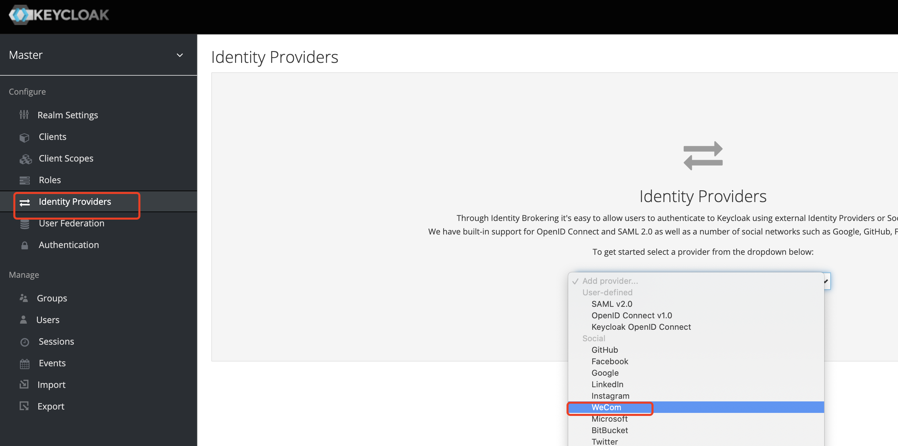
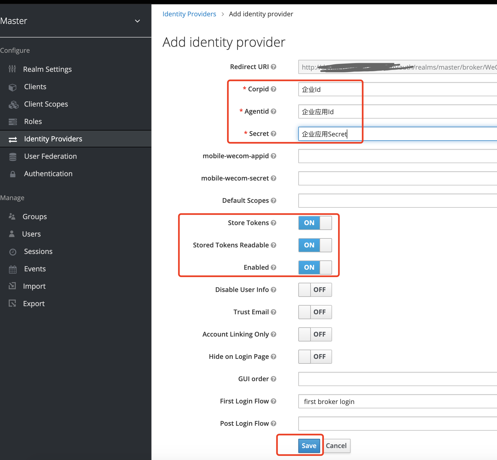

# Keycloak extensions

- Keycloak the collection of enterprise-level extension plugins, supporting such as Identity social Provider WeCom/dingtalk, cloudiam theme etc...

## 1. Quick Start

### 1.1 Deploy on Docker

```bash
sudo mkdir -p /mnt/disk1/keycloak/{data,theme}
sudo chmod 777 -R /mnt/disk1/keycloak/
docker run -d \
--name keycloak \
-p 8080:8080 \
-e KEYCLOAK_ADMIN=admin \
-e KEYCLOAK_ADMIN_PASSWORD=admin \
-v /mnt/disk1/keycloak/theme:/opt/keycloak/providers/ \
-v /mnt/disk1/keycloak/data/:/opt/keycloak/data/ \
docker.io/wl4g/keycloak-extension:1.0.0_17.0.0 start-dev \
--proxy edge \
--hostname-strict=false \
--log-level=DEBUG,org.hibernate:debug,org.hibernate.hql.internal.ast:info
```

- Browser view `http://localhost:8080`

Create WeCom Provider:


Input WeCom Info:


### 1.2 Deploy on Kubernetes with Helm

```bash
helm -n keycloak upgrade -i keycloak ./deploy/helm --create-namespace
```

## 2. Development Guide

```bash
git clone https://github.com/wl4g/keycloak-extension.git
cd keycloak-extension/

mvn clean package -DskipTests -Dmaven.test.skip=true -P '!gpg'
```

## 3. FAQ

TODO